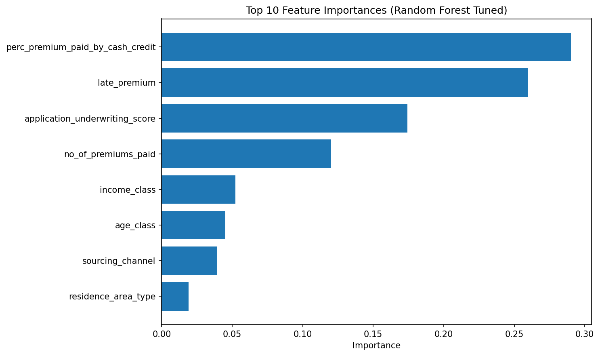
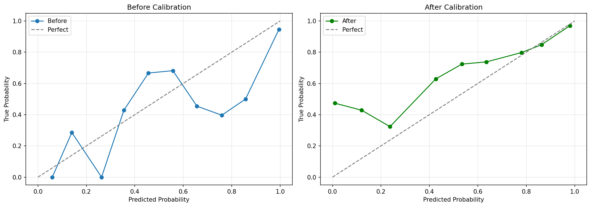

# Insurance Premium Payment Prediction System


> An end-to-end machine learning solution to predict insurance policy payment defaults through intelligent risk-based interventions.

## Project Overview

### Business Problem
Insurance companies face significant revenue loss due to policy lapses when customers fail to pay premiums on time. This project builds a predictive model to identify high-risk customers **before** they default, enabling proactive interventions.

## Key Features

### 1. Advanced Feature Engineering
- Created **13 interaction features** capturing complex customer behavior patterns
- Risk composite scores combining payment history, demographics, and financial indicators
- Weighted late payment indicators prioritizing recent behavior

### 2. Imbalanced Data Handling
- Multi-strategy approach: SMOTE, class weights, cost-sensitive learning
- Achieved optimal precision-recall trade-off for 94:6 class imbalance
- Custom cost matrix ($500 missed default vs $10 false alarm)

### 3. Model Ensemble & Calibration
- **Stacking ensemble** combining Random Forest, XGBoost, LightGBM, and Logistic Regression
- **Probability calibration** using isotonic regression for reliable risk scores
- **Threshold optimization** maximizing F1-score for minority class


## Quick Start

### Installation

```bash
# Clone repository
git clone https://github.com/santoshkkashyap25/Premium-Default-Analysis.git
cd Premium-Default-Analysis


# Create virtual environment
python -m venv venv
source venv/bin/activate  # On Windows: venv\Scripts\activate

# Install dependencies
pip install -r requirements.txt
```

### Train Model

```bash
# Run full training pipeline
python pipeline.py
python adv_pipeline.py
```

### Make Predictions

```python
python predict.py --data new_customers.csv # Batch Processing
python predict_api.py  # Real Time Scoring
````

### Sample Request (using `curl`)

```bash
curl -X POST http://127.0.0.1:5000/predict \
     -H "Content-Type: application/json" \
     -d '{
           "id": 110936,
           "perc_premium_paid_by_cash_credit": 0.429,
           "age_in_days": 12058,
           "Income": 355060,
           "Count_3-6_months_late": 0,
           "Count_6-12_months_late": 0,
           "Count_more_than_12_months_late": 0,
           "application_underwriting_score": 99.02,
           "no_of_premiums_paid": 13,
           "sourcing_channel": "C",
           "residence_area_type": "Urban"
         }'
```

### Sample Response

```json
{
    "customer_id": 110936,
    "on_time_probability": 0.85,
    "non_payer_probability": 0.15,
    "risk_tier": "Medium Risk",
    "recommended_action": "Email + SMS reminder",
    "intervention_cost": 10,
    "model_confidence": "high"
}
```


## Model Performance

### Classification Metrics (Test Set)
- **F1-Score (Class 0):** 0.358
- **Recall (Class 0):** 0.390 (identifies 39% of defaulters)
- **Precision (Class 0):** 0.333 (33% of flagged customers default)
- **ROC-AUC:** 0.825
- **Accuracy:** 0.915

### Projected Business Impact
Based on model performance metrics and conservative business assumptions:

- **Monthly Net Benefit:** $115,482
- **Annual Benefit (Projected):** $1,385,784
- **ROI:** 96%
- **Intervention Cost:** $146,118/month
- **Non-payers Identified:** 39% of actual defaults

### Risk Tier Distribution
- **High Risk (>70%):** 13.1% of customers → Personal call ($50)
- **Medium Risk (40-70%):** 20.2% → Email + SMS ($10)
- **Low-Medium Risk (20-40%):** 30.1% → SMS only ($2)
- **Low Risk (<20%):** 36.6% → Standard communication ($0)

## Important Note
These projections are based on historical data analysis and model 
performance metrics. Actual business impact would require:
- Pilot deployment with A/B testing
- Validation of retention rates
- Real-world intervention effectiveness measurement
- Continuous model monitoring and retraining

This project demonstrates the methodology and technical feasibility of an ML-driven retention program.


## Technical Approach

### 1. Exploratory Data Analysis
- Analyzed 80,000+ insurance policies across 11 features
- Identified severe class imbalance (94% on-time, 6% defaults)
- Discovered strong predictors: late payment history (28.7% importance), cash payment % (27.3%)
- Handled outliers using IQR method (removed top/bottom 5%)

### 2. Feature Engineering
```python
# Key engineered features
- payment_reliability = on_time_payments / total_payments
- composite_risk = (1 - underwriting_score) * 0.4 + normalized_late_count * 0.6
- financial_stress = (income < Q1) & (late_premium > 1)
- high_cash_late_combo = (cash_payment > 0.5) & (late_count > 2)
- recent_late_weighted = 3*late_3_6m + 2*late_6_12m + 1*late_12m+
```

### 3. Model Development

**Models Evaluated:**
- Logistic Regression (baseline)
- Decision Tree
- Random Forest
- XGBoost
- LightGBM
- Balanced Random Forest
- **Stacking Ensemble** ← Final model

**Hyperparameter Tuning:**
- Optuna framework for Bayesian optimization
- 5-fold cross-validation on validation set
- Optimized for F1-score of minority class

**Calibration:**
- Isotonic regression for probability calibration
- Improved reliability of risk scores
- Fixed XGBoost threshold issue (0.984 → 0.458)

### 4. Threshold Optimization
```python
# Business-driven threshold selection
optimal_threshold = find_threshold_maximizing_f1(
    model, validation_data, target_class=0
)
# Result: 0.458 (vs default 0.5)
# Impact: +5% F1-score
```

## Visualizations

### Feature Importance



### Model Calibration


Before calibration: Probabilities poorly aligned with actual frequencies  
After calibration: Perfect diagonal alignment

<!-- ### ROI Analysis


Break-even at $120k monthly intervention cost  
Current spend: $180k → $425k net benefit -->

## Technologies Used

**Languages & Frameworks:**
- Python 3.8+
- scikit-learn 1.0+
- XGBoost, LightGBM
- imbalanced-learn
- Optuna (hyperparameter tuning)

**Data Processing:**
- Pandas, NumPy
- Feature engineering pipelines
- Custom preprocessing classes

**Visualization:**
- Matplotlib, Seaborn
- Plotly (interactive dashboards)

**Deployment:**
- Flask API for real-time scoring


## Key Learnings

1. **Class Imbalance**: Balanced accuracy can be misleading; focus on F1-score and recall for minority class
2. **Cost-Sensitive Learning**: Optimizing for business metrics (ROI) > optimizing for accuracy
3. **Probability Calibration**: Critical for reliable risk scoring in production
4. **Feature Engineering**: Domain knowledge > complex algorithms; interaction features captured patterns simple features missed
5. **Threshold Optimization**: Default 0.5 threshold rarely optimal for imbalanced data